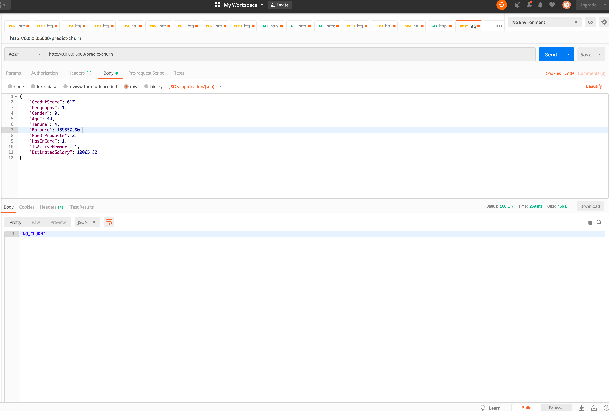

# Churn Analyse

This is a example project about churn analyse.
In this project, I analyzed data with about customer profiles with machine learning models in a notebook called `exploratory-analysis.ipynb`.
With the best result I have done a microservice.

Here is a print runing service accessed by REST.

